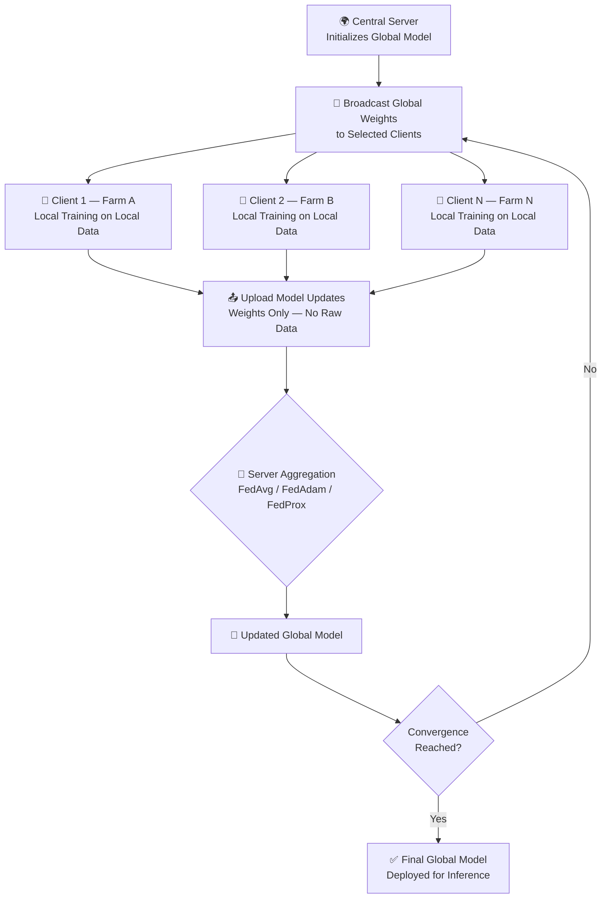
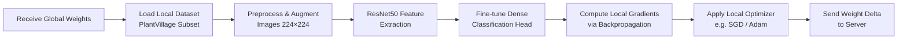
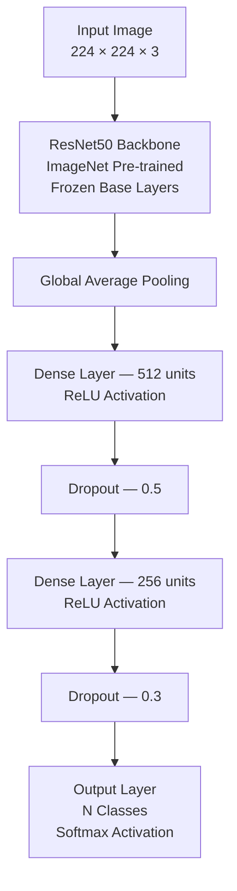

<div align="center">

# 🌿 Federated Learning for Crop Disease Detection

### Privacy-Preserving Agricultural AI Using Federated Learning on the PlantVillage Dataset

[](https://www.python.org/)
[](https://www.tensorflow.org/)
[](LICENSE)
[](notebooks/Crop_Disease_FL.ipynb)
[](https://www.manit.ac.in/)
[]()

<br/>

> **Research Internship Project** — Maulana Azad National Institute of Technology (MANIT), Bhopal  
> Applying Federated Learning to enable privacy-preserving, decentralized crop disease diagnosis across distributed agricultural devices.

</div>

---

## 📌 Table of Contents

- [Project Overview](#-project-overview)
- [Why This Matters](#-why-this-matters)
- [Features](#-features)
- [Project Architecture](#-project-architecture)
- [Repository Structure](#-repository-structure)
- [Dataset](#-dataset)
- [Model Architecture](#-model-architecture)
- [Federated Learning Algorithms](#-federated-learning-algorithms)
- [Training Configuration](#-training-configuration)
- [Results](#-results)
- [Future Improvements](#-future-improvements)
- [Setup & Installation](#-setup--installation)
- [References](#-references)
- [License](#-license)

---

## 🔍 Project Overview

Modern agriculture faces an enormous challenge: **crop diseases destroy an estimated 20–40% of global food production every year**, costing farmers billions. Early, accurate detection is critical — but deploying AI models for disease detection in rural settings raises two key problems:

1. **Data Privacy**: Farmers and agricultural organizations are often unwilling to share sensitive farm data with a central server.
2. **Connectivity**: Remote agricultural regions may have limited or intermittent internet access, making centralized training impractical.

This project addresses both problems by applying **Federated Learning (FL)** — a distributed machine learning paradigm where the model is trained *locally* on each device, and only model updates (gradients/weights) are shared with a central server. Raw data never leaves the device.

Using the **PlantVillage** dataset and a fine-tuned **ResNet50** backbone, this research benchmarks three federated optimization algorithms — **FedAvg**, **FedAdam**, and **FedProx** — to identify the most effective strategy for decentralized crop disease classification.

---

## 🌱 Why This Matters

| Challenge | Traditional Centralized AI | Federated Learning Approach |
|-----------|---------------------------|------------------------------|
| **Data Privacy** | Raw data sent to server | Data never leaves device |
| **Communication Cost** | Full dataset transfer | Only model updates shared |
| **Scalability** | Single point of failure | Distributed across edge nodes |
| **Rural Deployment** | Requires stable internet | Works with intermittent connectivity |
| **Data Heterogeneity** | Assumes i.i.d. data | Handles non-i.i.d. real-world distributions |

---

## ✅ Features

- ✅ **Federated Learning** — Fully distributed training without raw data sharing
- ✅ **FedAvg** — Canonical federated averaging aggregation algorithm
- ✅ **FedAdam** — Adaptive momentum-based federated optimizer
- ✅ **ResNet50** — Deep residual network with ImageNet pre-trained weights
- ✅ **Transfer Learning** — Fine-tuned backbone for domain-specific disease features
- ✅ **PlantVillage Dataset** — Industry-standard benchmark for plant pathology
- ✅ **TensorFlow / Keras** — Production-grade deep learning framework
- ✅ **Algorithm Comparison** — Systematic benchmarking across FL strategies

---

## 🏗️ Project Architecture

### High-Level Federated Learning Pipeline



### Client-Side Training Loop



### Model Architecture



---

## 📁 Repository Structure

```
Federated-Learning-Crop-Disease-Detection/
│
├── 📓 notebooks/
│     └── Crop_Disease_FL.ipynb       # Main experiment notebook
│
├── 🖼️ images/
│     ├── architecture.png            # System architecture diagram
│     ├── pipeline.png                # FL training pipeline
│     ├── accuracy.png                # Training & validation accuracy curves
│     ├── confusion_matrix.png        # Per-class confusion matrix
│     └── dataset_distribution.png   # Class distribution visualization
│
├── 📄 Report/
│     └── Federated_Learning_Report.pdf   # Full internship research report
│
├── 📋 requirements.txt              # Python dependencies
├── 📜 LICENSE                       # MIT License
├── 🙈 .gitignore                    # Python + Jupyter gitignore
└── 📖 README.md                     # This file
```

---

## 📊 Dataset

This project uses the **[PlantVillage Dataset](https://www.kaggle.com/datasets/emmarex/plantdisease)** — one of the most widely used benchmarks in agricultural AI research.

### Dataset Overview

| Property | Detail |
|----------|--------|
| **Source** | PlantVillage (Penn State University) |
| **Total Images** | 54,305 images |
| **Number of Crops** | 14 crop species |
| **Number of Classes** | 38 (healthy + disease variants) |
| **Image Format** | JPEG, RGB |
| **Image Resolution** | Resized to 224 × 224 |

### Split Strategy

| Split | Proportion | Purpose |
|-------|-----------|---------|
| Training | 70% | Local federated client training |
| Validation | 15% | Hyperparameter tuning & monitoring |
| Test | 15% | Final model evaluation |

### Federated Data Distribution

The dataset was partitioned across simulated clients to mimic **non-i.i.d. (non-independently and identically distributed)** conditions, reflecting real-world scenarios where individual farms grow different crops and encounter different diseases.

> 📌 **Note:** The PlantVillage dataset is publicly available. It is **not** included in this repository. Download instructions are provided in the notebook.

---

## 🧠 Model Architecture

### ResNet50 with Transfer Learning

The backbone of the classification model is **ResNet50** — a 50-layer deep residual network pre-trained on the **ImageNet** dataset (1.2M images, 1000 classes). Transfer learning allows the model to leverage rich visual feature representations learned on a large generic dataset and fine-tune them for the specialized domain of plant disease detection.

```
ResNet50 (Pre-trained, ImageNet)
    └── Frozen Base Layers (Convolutional Feature Extractor)
    └── Global Average Pooling
    └── Dense (512, ReLU)
    └── Dropout (0.5)
    └── Dense (256, ReLU)
    └── Dropout (0.3)
    └── Dense (N Classes, Softmax)
```

**Why ResNet50?**
- Residual connections prevent vanishing gradients in deep networks
- Pre-trained features transfer well to plant texture and color patterns
- Computationally efficient relative to deeper variants (ResNet101, ResNet152)
- Widely validated in plant pathology literature

---

## ⚙️ Federated Learning Algorithms

Three federated optimization strategies were implemented and compared:

| Algorithm | Core Idea | Strengths | Limitations |
|-----------|-----------|-----------|-------------|
| **FedAvg** | Weighted average of local model weights | Simple, communication-efficient, strong baseline | Struggles with highly non-i.i.d. data |
| **FedAdam** | Server-side Adam optimizer on aggregated updates | Faster convergence, adaptive learning rate | Requires tuning of β₁, β₂, ε |
| **FedProx** | Adds proximal term `μ/2 ‖w − wᵍ‖²` to local loss | Robust to non-i.i.d. data and partial participation | Additional μ hyperparameter to tune |

### Algorithm Details

#### FedAvg (McMahan et al., 2017)
The canonical federated learning algorithm. Each client runs `E` local epochs on its private data, then the server aggregates client weights as a weighted average proportional to dataset size.

```
wᵍ⁺¹ = Σₖ (nₖ / n) · wₖ
```

#### FedAdam (Reddi et al., 2020)
Introduces server-side adaptive optimization. The server applies an Adam-style update to the pseudo-gradient formed by the difference between old and new global weights.

```
Δ = wᵍ − Σₖ (nₖ / n) · wₖ
wᵍ⁺¹ = wᵍ − η · Adam(Δ)
```

#### FedProx (Li et al., 2018)
Modifies the local objective to include a proximal regularization term that constrains how far local models drift from the global model, improving stability under system and data heterogeneity.

```
min hₖ(w) = Fₖ(w) + μ/2 ‖w − wᵍ‖²
```

---

## 🛠️ Training Configuration

| Parameter | Value |
|-----------|-------|
| **Input Image Size** | 224 × 224 × 3 |
| **Batch Size** | 32 |
| **Local Epochs per Round** | 5 |
| **Federated Rounds** | 50 |
| **Learning Rate** | 1e-4 (fine-tuning) |
| **Optimizer (Client)** | SGD / Adam |
| **Loss Function** | Categorical Cross-Entropy |
| **Evaluation Metric** | Top-1 Accuracy, F1-Score |
| **FedProx μ** | 0.01 |
| **Number of Clients** | <!-- TODO: Add number of simulated clients --> |
| **Client Participation Rate** | <!-- TODO: Add participation fraction --> |
| **Framework** | TensorFlow 2.x / Keras |
| **Hardware** | <!-- TODO: Add GPU/CPU details --> |

---

## 📈 Results

> 📌 **Note:** Results will be populated after the full experiment notebook is committed. See [`notebooks/Crop_Disease_FL.ipynb`](notebooks/Crop_Disease_FL.ipynb).

### Accuracy Comparison (FedAvg vs FedAdam vs FedProx)

<!-- TODO: Replace with actual accuracy graph -->
```
📊 [INSERT: images/accuracy.png]
Training & validation accuracy curves across federated rounds for all three algorithms.
```

| Algorithm | Test Accuracy | F1-Score (Macro) | Convergence Round |
|-----------|:------------:|:----------------:|:-----------------:|
| FedAvg | <!-- TODO --> | <!-- TODO --> | <!-- TODO --> |
| FedAdam | <!-- TODO --> | <!-- TODO --> | <!-- TODO --> |
| FedProx | <!-- TODO --> | <!-- TODO --> | <!-- TODO --> |

### Confusion Matrix

<!-- TODO: Replace with actual confusion matrix -->
```
📊 [INSERT: images/confusion_matrix.png]
Per-class confusion matrix showing classification performance across all 38 plant disease categories.
```

### Classification Report

<!-- TODO: Add per-class precision, recall, F1 from notebook output -->

```
              precision    recall  f1-score   support

   [class_0]    X.XX       X.XX      X.XX       XXX
   [class_1]    X.XX       X.XX      X.XX       XXX
       ...       ...        ...       ...        ...

   accuracy                          X.XX      XXXX
  macro avg      X.XX       X.XX      X.XX      XXXX
weighted avg      X.XX       X.XX      X.XX      XXXX
```

### Dataset Distribution

<!-- TODO: Replace with actual distribution chart -->
```
📊 [INSERT: images/dataset_distribution.png]
Class distribution across PlantVillage categories.
```

---

## 🚀 Future Improvements

The following directions extend this work toward production-grade federated agricultural AI:

| Improvement | Description | Priority |
|-------------|-------------|----------|
| 🔐 **Secure Aggregation** | Cryptographic protocols (e.g., SecAgg) to protect client updates from the server | High |
| 🔏 **Differential Privacy** | Add calibrated noise (DP-SGD) to guarantee formal privacy guarantees | High |
| 🔄 **FedBN** | Federated batch normalization to handle feature shift across clients | Medium |
| 🌸 **Flower Framework** | Migrate to the [Flower (flwr)](https://flower.ai/) framework for production-ready FL | Medium |
| 📱 **Mobile Deployment** | Export model via TFLite for Android/iOS farmer apps | High |
| 🔌 **Edge Deployment** | Deploy on Raspberry Pi / NVIDIA Jetson for on-farm inference | Medium |
| 🌐 **Real Data Collection** | Partner with agricultural organizations for authentic, non-simulated federated data | Long-term |
| 🔬 **EfficientNet / ViT** | Benchmark against EfficientNetV2 or Vision Transformer backbones | Medium |
| 📡 **Asynchronous FL** | Implement async aggregation to handle stragglers and intermittent connectivity | Medium |

---

## 💻 Setup & Installation

### Prerequisites

- Python 3.9 or higher
- pip package manager
- (Recommended) NVIDIA GPU with CUDA 11.8+ for accelerated training

### Clone the Repository

```bash
git clone https://github.com/AnushkaSarviya/Federated-Learning-Crop-Disease-Detection.git
cd Federated-Learning-Crop-Disease-Detection
```

### Create a Virtual Environment

```bash
python -m venv venv

# Windows
venv\Scripts\activate

# macOS / Linux
source venv/bin/activate
```

### Install Dependencies

```bash
pip install -r requirements.txt
```

### Download the Dataset

1. Visit [PlantVillage on Kaggle](https://www.kaggle.com/datasets/emmarex/plantdisease)
2. Download and extract to a `data/` folder in the project root (excluded from git via `.gitignore`)

### Run the Notebook

```bash
jupyter notebook notebooks/Crop_Disease_FL.ipynb
```

---

## 📚 References

1. **McMahan, B., Moore, E., Ramage, D., Hampson, S., & y Arcas, B. A. (2017).** Communication-efficient learning of deep networks from decentralized data. *AISTATS 2017*. [arXiv:1602.05629](https://arxiv.org/abs/1602.05629)

2. **Reddi, S., Charles, Z., Zaheer, M., Garrett, Z., Rush, K., Konečný, J., Kumar, S., & McMahan, H. B. (2020).** Adaptive federated optimization. *ICLR 2021*. [arXiv:2003.00295](https://arxiv.org/abs/2003.00295)

3. **Li, T., Sahu, A. K., Zaheer, M., Sanjabi, M., Talwalkar, A., & Smith, V. (2018).** Federated optimization in heterogeneous networks. *MLSys 2020*. [arXiv:1812.06127](https://arxiv.org/abs/1812.06127)

4. **Hughes, D. P., & Salathé, M. (2015).** An open access repository of images on plant health to enable the development of mobile disease diagnostics. [arXiv:1511.08060](https://arxiv.org/abs/1511.08060)

5. **He, K., Zhang, X., Ren, S., & Sun, J. (2016).** Deep residual learning for image recognition. *CVPR 2016*. [arXiv:1512.03385](https://arxiv.org/abs/1512.03385)

6. **Konečný, J., McMahan, H. B., Yu, F. X., Richtárik, P., Suresh, A. T., & Bacon, D. (2016).** Federated learning: Strategies for improving communication efficiency. [arXiv:1610.05492](https://arxiv.org/abs/1610.05492)

---

## 📬 Contact

**Anushka Sarviya**  
Research Intern, MANIT Bhopal  
[](https://github.com/AnushkaSarviya)

---

## 📄 License

This project is licensed under the **MIT License** — see the [LICENSE](LICENSE) file for details.

---

<div align="center">

**⭐ If this project helped your research, please consider starring the repository.**

*Built with ❤️ during research internship at MANIT Bhopal*

</div>
