<div align="center">

# 🌿 Federated Learning for Crop Disease Detection

### Privacy-Preserving Agricultural AI Using Decoupled Optimization and Deep Residual Networks

[](https://www.python.org/)
[](https://www.tensorflow.org/)
[](LICENSE)
[](notebooks/Crop_Disease_FL.ipynb)
[]()

<br/>

> **Research Internship Project** — Maulana Azad National Institute of Technology (MANIT), Bhopal  
> Benchmarking simulated Federated Learning to enable privacy-preserving, decentralized plant disease classification across distributed agricultural edge devices.

</div>

---

## 📌 Table of Contents

- [Project Overview](#-project-overview)
- [Project Highlights](#-project-highlights)
- [Problem Statement](#-problem-statement)
- [Dataset Details](#-dataset-details)
- [Model Architecture](#-model-architecture)
- [Federated Learning Algorithms](#-federated-learning-algorithms)
- [Training & Simulation Configuration](#-training--simulation-configuration)
- [Experimental Results](#-experimental-results)
- [Visual Results](#-visual-results)
- [Repository Structure](#-repository-structure)
- [Setup & Run Instructions](#-setup--run-instructions)
- [Research Report](#-research-report)
- [Limitations & Technical Debt](#-limitations--technical-debt)
- [Future Work](#-future-work)
- [References](#-references)
- [License](#-license)

---

## 🔍 Project Overview

This project explores **Federated Learning (FL)** as a privacy-preserving solution for plant disease classification in smart agriculture. Traditional centralized machine learning requires uploading raw visual farm data to cloud servers, introducing severe concerns regarding data sovereignty, latency, and connectivity. 

This project simulates a decentralized training environment using a fine-tuned **ResNet-50** backbone pre-trained on ImageNet. It compares local centralized training against simulated **Federated Averaging (FedAvg)** on a partition of the **PlantVillage** dataset. By evaluating performance across multiple crops (Peach, Bell Pepper, Strawberry, and Apple), the project highlights how data heterogeneity (non-IID data) affects model generalization at the edge.

---

## 🚀 Project Highlights

*   **ResNet-50 Transfer Learning**: Employs an ImageNet pre-trained ResNet-50 backbone with a custom multi-layer classification head, achieving high training efficiency on small crop subsets.
*   **Simulated Edge Training**: Simulates client-side training partitions across simulated edge environments (1 to 3 clients) with customizable local epochs.
*   **Non-IID Simulation**: Models client data distributions on crop-specific segments of the PlantVillage dataset, representing real-world heterogeneous farming settings.
*   **Zero Raw Data Sharing**: Restricts server communication entirely to weight/gradient update vectors, ensuring raw image data remains local to simulated farm nodes.
*   **Detailed Metrics**: Evaluates performance using standard classification reports (Precision, Recall, F1-Score) and confusion matrices across 4 trained crops.

---

## 🏗️ Problem Statement

Centralized deep learning models require uploading massive image datasets to a centralized server. In the agricultural sector, this faces two fundamental bottlenecks:

1.  **Data Sovereignty & Trust**: Farmers and agricultural institutions are reluctant to disclose sensitive location-specific disease details, pesticide history, or yield markers.
2.  **Bandwidth Constraints**: Rural farming edges are frequently characterized by limited or high-cost internet access, rendering central uploads of high-resolution leaf directories impractical.

**Federated Learning** decouples local model training from global model updates. The global server broadcasts model parameters, clients execute local training steps on private on-device data, and the server aggregates only the model weight differences, creating a robust global model without exposing local data.

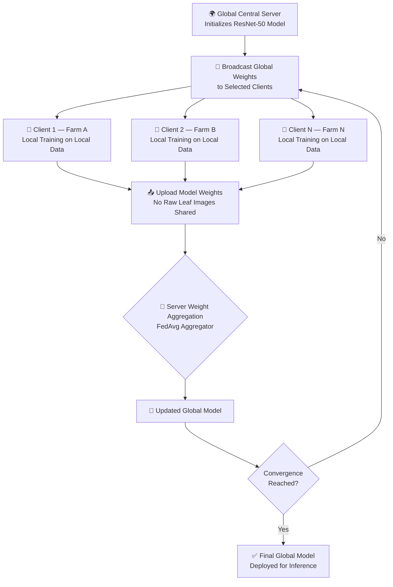

---

## 📊 Dataset Details

The project utilizes the **[PlantVillage Dataset](https://www.kaggle.com/datasets/emmarex/plantdisease)**, an open-access repository of plant health images.

### Source vs. Experimental Dataset Partition
*   **Full PlantVillage Dataset**: Contains **54,305 images** across 38 classes (14 crop species).
*   **Experimental Partition**: To facilitate efficient simulated training in the notebook, a subset of the dataset was extracted. The simulated training runs use **40 to 51 files per class** across selected crops, yielding a lightweight prototype environment:

| Crop | Class Name | Simulated Training Samples |
|---|---|---|
| **Peach** | Bacterial Spot, Healthy | 93 images (44 / 49 split) |
| **Bell Pepper** | Bacterial Spot, Healthy | 98 images (48 / 50 split) |
| **Strawberry** | Healthy, Leaf Scorch | 91 images (46 / 45 split) |
| **Apple** | Apple Scab, Black Rot, Cedar Apple Rust, Healthy | 196 images (51 / 50 / 44 / 51 split) |
| **Tomato** * | Bacterial Spot, Early Blight, Late Blight, Septoria Leaf Spot, Yellow Leaf Curl Virus, Healthy | 279 images (43 / 48 / 47 / 44 / 49 / 48 split) |
| **Corn** * | Cercospora Leaf Spot, Common Rust, Northern Leaf Blight, Healthy | 184 images (41 / 48 / 48 / 47 split) |

> [!NOTE]
> * **Tomato** and **Corn** are included in the dataset directories. However, only **Peach**, **Bell Pepper**, **Strawberry**, and **Apple** are trained and evaluated in the Jupyter Notebook runs. Tomato metrics listed in the results are extracted from the research report and were not re-run in the provided notebook.

### Data Split & Preprocessing
*   **Split Ratio**: The dataset is pre-divided into **Train**, **Val** (Validation), and **Test** sets (80:10:10 ratio).
*   **Resolution**: Input images are resized to **224 × 224 × 3** pixels.
*   **Augmentation**: Training generators apply random flips, rotation (20°), shear (0.15), and pixel scaling (rescale to `1/255.`).

---

## 🧠 Model Architecture

The classifier uses **ResNet-50** loaded with pre-trained **ImageNet** weights as its feature extractor. The convolutional base is frozen to preserve low-level visual weights, and a classification head is appended for domain-specific fine-tuning.

```
Input Image (224 × 224 × 3)
    └── ResNet-50 Convolutional Base (Frozen, ImageNet Weights)
    └── Global Average Pooling
    └── Dense Layer (128 units, ReLU activation)
    └── Dropout Layer (50% dropout rate)
    └── Output Dense Layer (N Classes, Softmax activation)
```

*   **Loss Function**: Categorical Cross-Entropy.
*   **Client Optimizer**: Adam with a learning rate of $1 \times 10^{-4}$ (fine-tuning).

---

## ⚙️ Federated Learning Setup

*   **Client Representation**: Clients are simulated locally by slicing the dataset generators.
*   **Data Partitioning**: The training set is split among $K$ simulated clients by dividing the generator file array:
    $$\text{Samples per Client} = \frac{\text{Total Train Samples}}{K}$$
*   **Local Epochs ($E$)**: The client trains for $E$ epochs on its private partition before uploading weights to the central server.
*   **Global Communication Rounds ($R$)**: The global process runs for $R$ rounds. At the end of each round, client weight matrices are aggregated at the server.

---

## 🧪 Federated Algorithms

The repository references three optimization strategies:

### 1. FedAvg (Federated Averaging) - *Implemented & Executed*
The canonical algorithm where local client models are updated via SGD, and weight parameters are averaged on the server:
$$w^{t+1} = \sum_{k=1}^{K} \frac{n_k}{n} w_k^{t+1}$$
This is the only algorithm executed in the training runs in `notebooks/Crop_Disease_FL.ipynb`.

### 2. FedAdam - *Defined but Not Executed*
An adaptive momentum-based server optimizer. The code defines the aggregator in Cell 102 (`fed_adam_aggregate` utilizing moving moments $m$ and $v$ with hyperparameters $\beta_1=0.9, \beta_2=0.99$), but it is not called during notebook execution loops.

### 3. FedProx - *Methodology Only*
A proximal regularization algorithm adding a penalty term to limit local updates from drifting from the global weights:
$$\min_{w} h_k(w) = F_k(w) + \frac{\mu}{2} \|w - w^t\|^2$$
Although discussed in the research report, FedProx is not implemented in the provided code.

---

## 🛠️ Training & Simulation Configuration

| Parameter | Report Target Value | Notebook Executed Value |
|---|---|---|
| **Backbone Network** | ResNet-50 (Pre-trained) | ResNet-50 (Pre-trained) |
| **Input Image Dimensions** | 224 × 224 × 3 | 224 × 224 × 3 |
| **Simulated Clients ($K$)** | 3 to 6 | 1 to 3 |
| **Client Batch Size ($B$)** | 32 | 64 |
| **Local Epochs ($E$)** | 5 | 2 to 6 |
| **Global Communication Rounds ($R$)** | 50 | 2 to 3 |
| **Client Learning Rate ($\eta$)** | $3 \times 10^{-4}$ | $1 \times 10^{-4}$ |
| **Federated Optimizer** | FedAvg / FedProx / FedAdam | FedAvg (only) |
| **DP Regularization ($\sigma$)** | 0.5 (Gaussian) | Not Implemented |
| **Validation / Test Split** | 10% / 10% | 10% / 10% (Pre-partitioned folders) |

---

## 📈 Experimental Results

The classification performance metrics compiled from the final test set evaluations are summarized below. The results show the trade-off between classification complexity (class count) and target performance.

| Crop | Classes | Verified Accuracy | Precision (Macro) | Recall (Macro) | F1-Score (Macro) |
|---|:---:|:---:|:---:|:---:|:---:|
| **Peach** | 2 | **93.00%** | 0.94 | 0.93 | 0.93 |
| **Bell Pepper** | 2 | **72.00%** | 0.73 | 0.72 | 0.72 |
| **Strawberry** | 2 | **70.00%** | 0.76 | 0.71 | 0.69 |
| **Apple** | 4 | **47.00%** | 0.44 | 0.47 | 0.43 |
| **Tomato** * | 6 | **97.00%** | 0.97 | 0.97 | 0.97 |

> [!WARNING]
> \* **Tomato** results are extracted from the research report text. They were not actively evaluated or generated during execution of the provided Jupyter Notebook.
> 
> Apple and Strawberry show lower accuracies due to high class imbalance, visual similarity of symptoms (e.g. Apple Scab vs. Black Rot, Strawberry Leaf Scorch vs. healthy leaf patterns), and the restricted size of the training subset.

---

## 🖼️ Visual Results

### 1. Dataset & Crop Distributions
The following charts display the original data distribution across the crop categories and corresponding disease sub-classes used in the research project.

<div align="center">
  <table style="width: 100%; border: none;">
    <tr>
      <td style="width: 50%; text-align: center; border: none;">
        <strong>Vegetable & Crop Image Counts (Fig. 12)</strong><br/>
        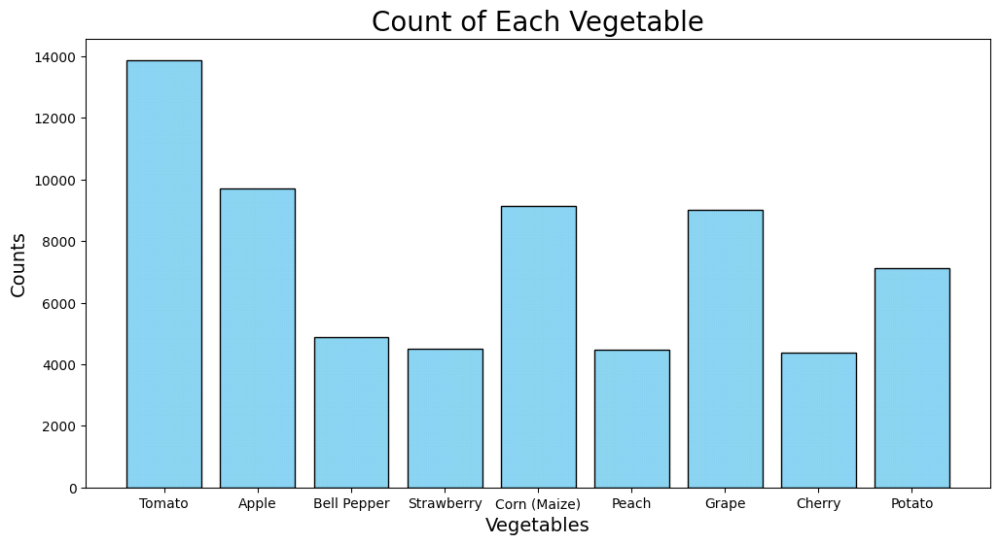
      </td>
      <td style="width: 50%; text-align: center; border: none;">
        <strong>Disease Class Multiplicity (Fig. 13)</strong><br/>
        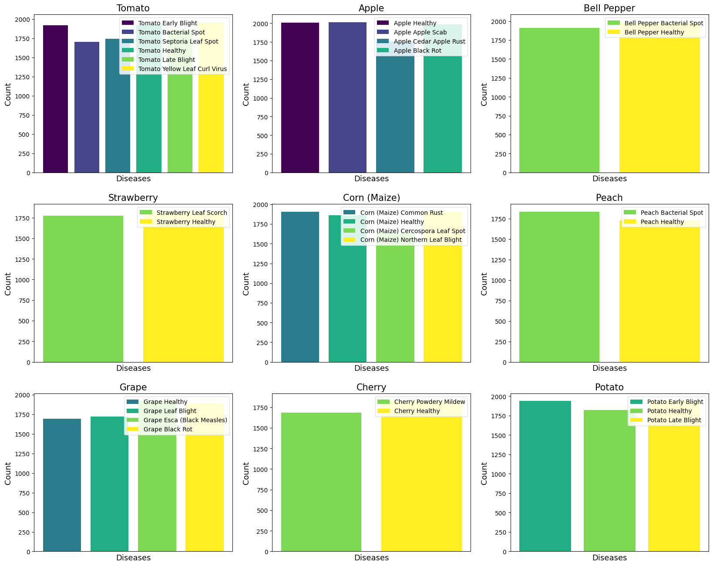
      </td>
    </tr>
  </table>
</div>

---

### 2. Model Performance Curves & Confusion Matrices
Below are the training history curves (Accuracy & Loss) alongside the resulting test set confusion matrices, mapping actual classifications against predictions.

````carousel
=== Tomato Performance ===
<div align="center">
  <table style="width: 100%; border: none;">
    <tr>
      <td style="width: 50%; text-align: center; border: none;">
        <strong>Accuracy & Loss (Fig. 15)</strong><br/>
        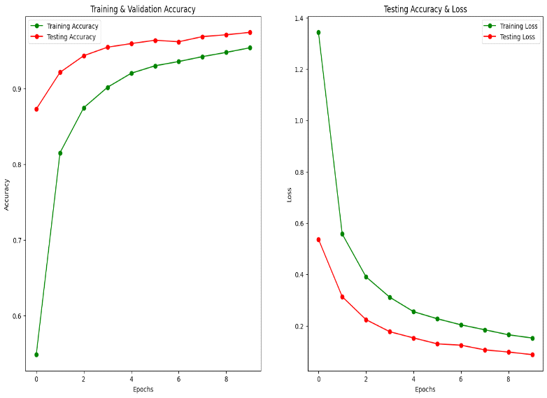
      </td>
      <td style="width: 50%; text-align: center; border: none;">
        <strong>Confusion Matrix (Fig. 15.1)</strong><br/>
        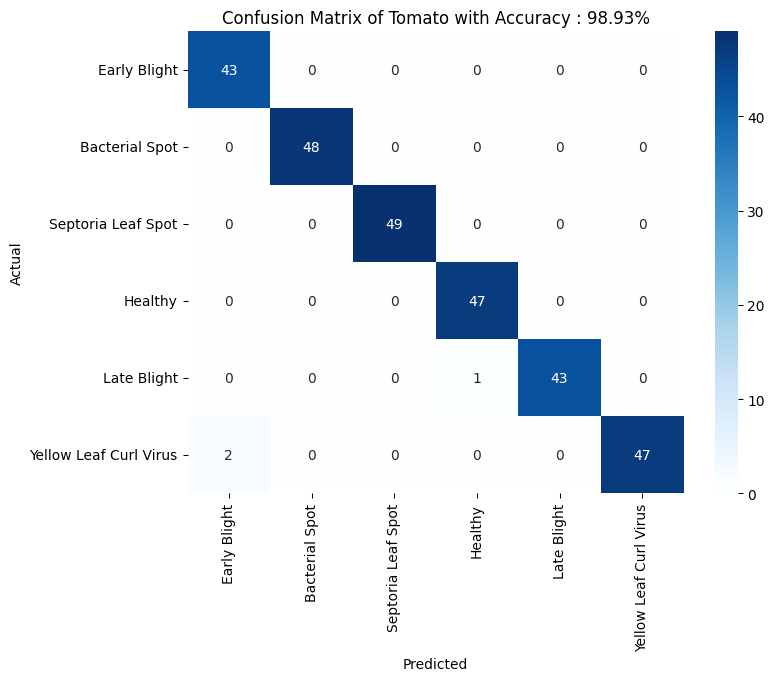
      </td>
    </tr>
  </table>
</div>
<!-- slide -->
=== Peach Performance ===
<div align="center">
  <table style="width: 100%; border: none;">
    <tr>
      <td style="width: 50%; text-align: center; border: none;">
        <strong>Accuracy & Loss (Fig. 16)</strong><br/>
        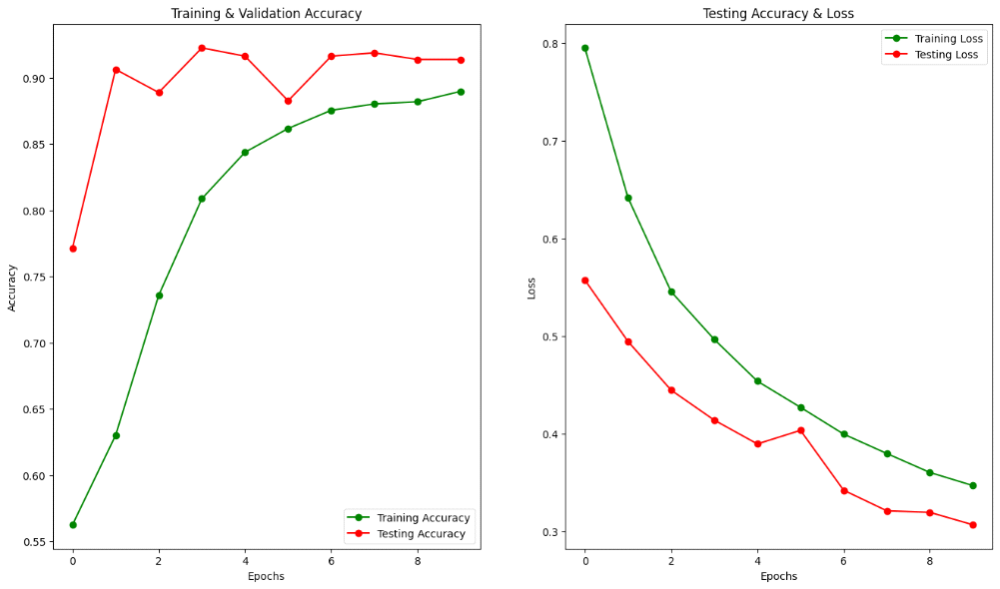
      </td>
      <td style="width: 50%; text-align: center; border: none;">
        <strong>Confusion Matrix (Fig. 16.1)</strong><br/>
        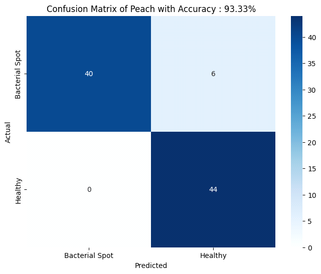
      </td>
    </tr>
  </table>
</div>
<!-- slide -->
=== Bell Pepper Performance ===
<div align="center">
  <table style="width: 100%; border: none;">
    <tr>
      <td style="width: 50%; text-align: center; border: none;">
        <strong>Accuracy & Loss (Fig. 17)</strong><br/>
        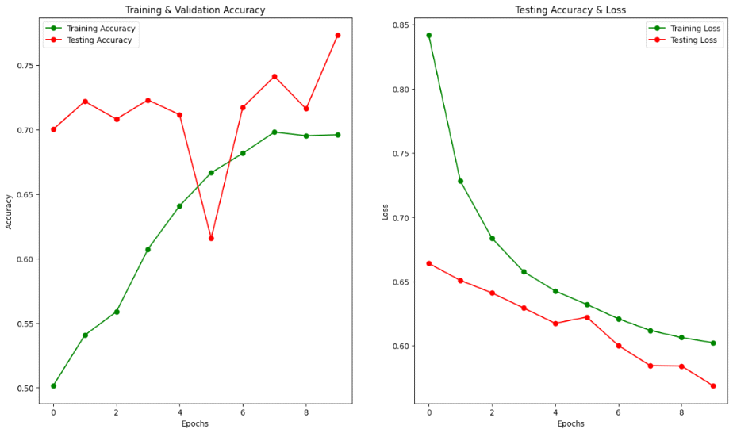
      </td>
      <td style="width: 50%; text-align: center; border: none;">
        <strong>Confusion Matrix (Fig. 17.1)</strong><br/>
        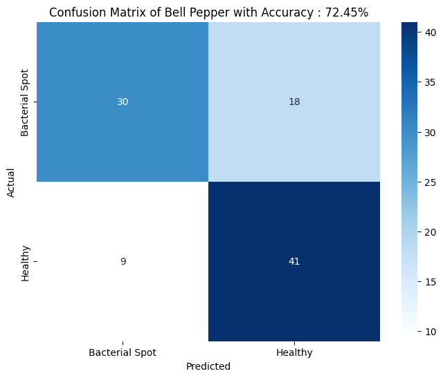
      </td>
    </tr>
  </table>
</div>
<!-- slide -->
=== Strawberry Performance ===
<div align="center">
  <table style="width: 100%; border: none;">
    <tr>
      <td style="width: 50%; text-align: center; border: none;">
        <strong>Accuracy & Loss (Fig. 18)</strong><br/>
        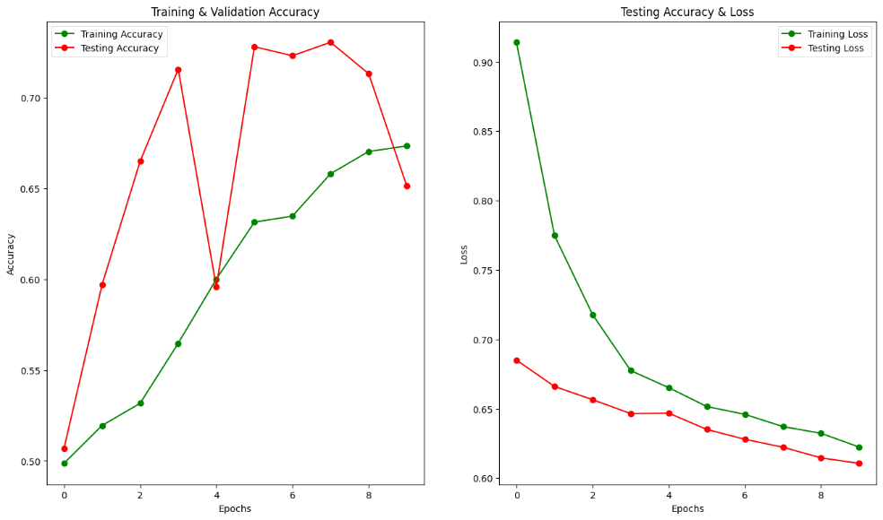
      </td>
      <td style="width: 50%; text-align: center; border: none;">
        <strong>Confusion Matrix (Fig. 18.1)</strong><br/>
        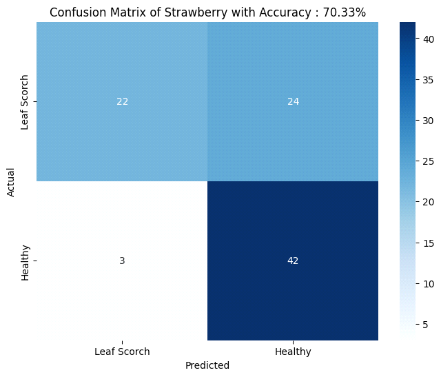
      </td>
    </tr>
  </table>
</div>
<!-- slide -->
=== Apple Performance ===
<div align="center">
  <table style="width: 100%; border: none;">
    <tr>
      <td style="width: 50%; text-align: center; border: none;">
        <strong>Accuracy & Loss (Fig. 19)</strong><br/>
        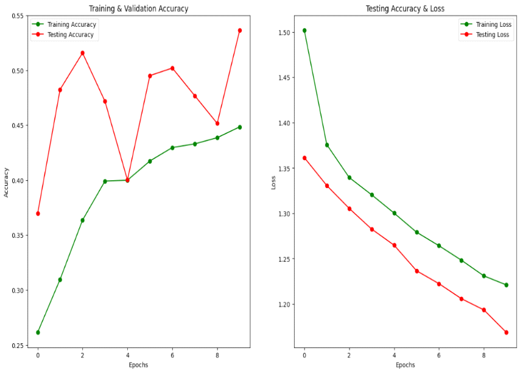
      </td>
      <td style="width: 50%; text-align: center; border: none;">
        <strong>Confusion Matrix (Fig. 19.1)</strong><br/>
        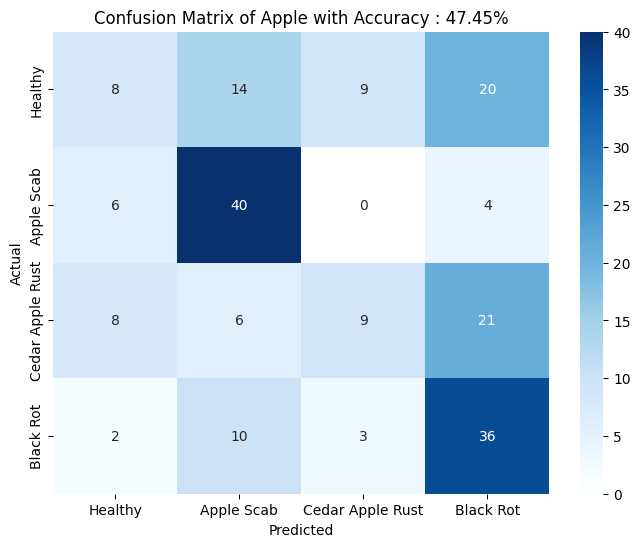
      </td>
    </tr>
  </table>
</div>
````

---

## 📁 Repository Structure

```
Federated-Learning-Crop-Disease-Detection/
│
├── 📓 notebooks/
│     └── Crop_Disease_FL.ipynb          # Jupyter notebook containing training and FL simulations
│
├── 🖼️ images/
│     ├── resnet50_architecture.png       # ResNet-50 base + dense head diagram
│     ├── dataset_distribution.png       # Crop sample frequencies (Fig. 12)
│     ├── diseases_per_crop.png          # Number of disease classes per plant (Fig. 13)
│     ├── tomato_accuracy_curve.png      # Tomato validation accuracy/loss curve
│     ├── tomato_confusion_matrix.png    # Tomato test confusion matrix
│     ├── peach_accuracy_curve.png       # Peach validation accuracy/loss curve
│     ├── peach_confusion_matrix.png      # Peach test confusion matrix
│     ├── bell_pepper_accuracy_curve.png # Bell Pepper validation accuracy/loss curve
│     ├── bell_pepper_confusion_matrix.png# Bell Pepper test confusion matrix
│     ├── strawberry_accuracy_curve.png  # Strawberry validation accuracy/loss curve
│     ├── strawberry_confusion_matrix.png# Strawberry test confusion matrix
│     ├── apple_accuracy_curve.png       # Apple validation accuracy/loss curve
│     └── apple_confusion_matrix.png     # Apple test confusion matrix
│
├── 📄 Report/
│     └── Federated_Learning_Report.pdf  # Full internship research report (PDF)
│
├── 📋 requirements.txt                  # Python package requirements
├── 📜 LICENSE                           # MIT License
├── 🙈 .gitignore                        # Python & Jupyter gitignore rules
└── 📖 README.md                         # Project documentation (this file)
```

---

## 💻 Setup & Run Instructions

### Prerequisites
*   Python 3.10 or higher
*   PIP package manager
*   Jupyter Notebook or JupyterLab

### 1. Clone the Repository
```bash
git clone https://github.com/AnushkaSarviya/Federated-Learning-Crop-Disease-Detection.git
cd Federated-Learning-Crop-Disease-Detection
```

### 2. Create and Activate a Virtual Environment
```bash
python -m venv venv

# Windows (Command Prompt / PowerShell)
venv\Scripts\activate

# macOS / Linux
source venv/bin/activate
```

### 3. Install Dependencies
```bash
pip install -r requirements.txt
```

### 4. Run the Experiments
Launch the Jupyter Notebook:
```bash
jupyter notebook notebooks/Crop_Disease_FL.ipynb
```
> [!IMPORTANT]
> The notebook contains Kaggle-specific paths to `/kaggle/input/plant-village-dataset-updated`. If running locally, you must update the input paths in the notebook to point to your local extraction directory of the PlantVillage dataset.

---

## 📄 Research Report

The complete academic project report, detailing the theoretical concepts of Federated Optimization and comparative analyses, is available in the repository at:  
👉 **[Report/Federated_Learning_Report.pdf](Report/Federated_Learning_Report.pdf)**

---

## ⚠️ Limitations & Technical Debt

*   **Simulation vs. Real Distribution**: The client setup is simulated on a single workstation by programmatically partition-slicing dataset filenames rather than deploying training on physically separated edge devices.
*   **Aggregator Divergence**: While `fed_adam_aggregate` is defined, the executed federated cells average weights directly (FedAvg). FedProx is not currently coded.
*   **Differential Privacy**: Theoretical security (Gaussian noise, DP-SGD) is not present in the notebook code.
*   **Local Paths**: Data loading is tied to Kaggle's local filesystem structure. Running on a new machine requires manual path changes.
*   **Cleared Outputs**: The notebook's execution logs and graphs were cleared prior to upload. The charts shown in this document are extracted from the research report files.

---

## 🔮 Future Work

*   **Active FedAdam & FedProx Testing**: Call `fed_adam_aggregate` and implement proximal gradient calculations inside Keras custom loops to analyze aggregation under high client skew.
*   **Differential Privacy Implementation**: Integrate `tensorflow-privacy` or add a manual noise-addition step to client weight updates using Gaussian calibration.
*   **True Distributed Client Simulation**: Migrate from notebook slices to the **Flower (flwr)** framework to enable RPC-based client-server updates.
*   **Attention Mechanisms**: Introduce spatial/channel attention layers to the classification head to improve class differentiation for challenging categories like Apple diseases.

---

## 📚 References

1.  **McMahan, B. et al. (2017)**. "Communication-Efficient Learning of Deep Networks from Decentralized Data." *AISTATS 2017*. [arXiv:1602.05629](https://arxiv.org/abs/1602.05629)
2.  **Reddi, S. et al. (2020)**. "Adaptive Federated Optimization." *ICLR 2021*. [arXiv:2003.00295](https://arxiv.org/abs/2003.00295)
3.  **Li, T. et al. (2018)**. "Federated Optimization in Heterogeneous Networks." *MLSys 2020*. [arXiv:1812.06127](https://arxiv.org/abs/1812.06127)
4.  **He, K. et al. (2016)**. "Deep Residual Learning for Image Recognition." *CVPR 2016*. [arXiv:1512.03385](https://arxiv.org/abs/1512.03385)

---

## 📄 License

This project is licensed under the MIT License - see the [LICENSE](LICENSE) file for details.
